# Initial exploration — CUGN climatology (2026 beta)

**Date:** 2026-07-15
**Data:** `$OS_SPRAY/CUGN/Climatology/2026 beta/` — 80 NetCDF files, 5.9 GB
**Source:** https://spraydata.ucsd.edu/products/cugn-climatology/new.php
**Explorer script:** `cugn_climatology/explore_2026beta.py` (writes `context/file_inventory.csv`)
**Provenance:** CF-1.9 / ACDD-1.3, Level-4 products from Scripps (Rudnick et al.),
`date_created` 2026-07-15 — freshly generated.

## 1. What the 80 files are

Each file name decodes as `{group}_{product}_{vcoord}_{line}.nc`:

- **group** — `lt` (long-term) or `st` (short-term). See §4; they are two
  different baseline periods, not two resolutions.
- **product** — one of five (see §3): `mean`, `annual_cycle`,
  `mean_annual_cycle`, `anomaly`, `total`.
- **vcoord** — vertical coordinate: `depth` (z) or `sigma` (potential density).
- **line** — CUGN section: `66`, `80`, `90` for `lt`; `56`, `66`, `80`, `90`,
  and `al` (alongshore) for `st`.

Counts (each product exists in both depth and sigma):

| group | lines | products | files |
|-------|-------|----------|-------|
| lt    | 66, 80, 90 (3)          | 5 | 3 × 5 × 2 = 30 |
| st    | 56, 66, 80, 90, al (5)  | 5 | 5 × 5 × 2 = 50 |
| **total** | | | **80** |

## 2. Grids and geometry

- **Cross-shore:** `distance` in km at 5 km spacing, starting at 0 **inshore**
  and increasing offshore. Each line has a different length / station count:

  | line | stations | length (km) | inshore (lat, lon) | offshore (lat, lon) |
  |------|----------|-------------|--------------------|---------------------|
  | 56 | 61  | 300 | 38.53, -123.27 | 37.17, -126.23 |
  | 66 | 81  | 400 | 36.89, -121.84 | 35.09, -125.71 |
  | 80 | 74  | 365 | 34.47, -120.48 | 32.83, -123.89 |
  | 90 | 107 | 530 | 33.50, -117.75 | 31.11, -122.61 |
  | al | 45  | 220 | 32.42, -119.96 | 34.13, -121.14 |

  (`al` is the alongshore line and runs roughly S→N rather than offshore.)
  `latitude`/`longitude` are 1-D coordinates along `distance`.

- **Vertical:** `depth` files have 50 levels, 10–500 m at 10 m spacing.
  `sigma` files have 21 levels of `potential_density` from 25.0 to 27.0
  kg m⁻³ at 0.1 spacing.

- **Time** (products that carry it): 10-day cadence.

## 3. The five products (and how they relate)

For a given group/line/vcoord:

| product | dims | meaning |
|---------|------|---------|
| `mean` | (depth, distance) | Time-independent mean field |
| `annual_cycle` | (time=365, depth, distance) | Daily climatological cycle, **anomaly form** (mean removed) |
| `mean_annual_cycle` | (time=365, depth, distance) | `mean + annual_cycle` (the full seasonal field) |
| `anomaly` | (time, depth, distance) | Interannual anomaly (10-day cadence) |
| `total` | (time, depth, distance) | The reconstructed observed field |

**Verified additive decomposition** (temperature, lt/depth/line 90, exact to
floating point):

```
total(t) = mean + annual_cycle[doy(t)] + anomaly(t)
mean_annual_cycle = mean + annual_cycle
```

So `mean`, `annual_cycle`, and `anomaly` are the three independent pieces;
`mean_annual_cycle` and `total` are conveniences derived from them. The
`annual_cycle` files span a nominal year (2007-01-10 → 2008-01-09, 365 days).

## 4. lt vs st — two baseline periods

Same variables and grids; they differ in the observational window used:

| group | `time_coverage` (mean) | anomaly/total time span |
|-------|------------------------|-------------------------|
| lt (long-term)  | 2007-01-01 → 2014-01-01 | 2006/2007 → 2026 |
| st (short-term) | 2017-01-01 → 2025-01-01 | 2017/2019/2020 → 2026 |

The two means differ meaningfully — e.g. line 90 temperature is on average
**+0.23 °C warmer** in `st` than `lt` (max local difference ~1.05 °C),
consistent with recent warming relative to the earlier baseline. **Open
question for you (see Q&A): confirm the intended lt/st definitions and how you
want anomalies referenced.**

The anomaly/total records start at different years per line (data availability):
lt line 66 begins 2007, lines 80/90 begin 2006; st line 56 begins 2020, `al`
begins 2019, lines 66/80/90 begin 2017.

## 5. Variables

**The variable set differs between `st` and `lt` — this is the key correction
to my first pass** (which only inspected `lt` line 90 and wrongly concluded
there was no oxygen). Verified by scanning all 80 files
(`scratchpad`-driven, now folded into the exploration):

Common to both groups (all products, both vcoords): `temperature` (°C),
`salinity` (PSS-78), `chlorophyll_a` (mg m⁻³), `sigma_t` (kg m⁻³),
`potential_temperature`, `geostrophic_velocity` (m s⁻¹),
`doppler_velocity_along`, `doppler_velocity_across`.

**Present only in the `st` (short-term) files — all 50 of them:**

- `doxy` — Dissolved Oxygen Molar Concentration
  (`mole_concentration_of_dissolved_molecular_oxygen_in_sea_water`)
- `acoustic_backscatter`

**So dissolved oxygen IS in the 2026 beta — in the short-term products.** It is
absent from every `lt` file. This is physically sensible: dissolved-oxygen and
acoustic-backscatter sensors became standard on the gliders more recently, so
the 2007–2014 long-term baseline predates reliable coverage while the 2017–2025
short-term period has it. (This answers your Q&A note "I expect DO to be
present.")

Other per-file variations:

- `potential_density` appears only in the `mean` and `mean_annual_cycle`
  products (depth coord). The `annual_cycle`, `anomaly`, and `total` products
  omit it — it is not carried as an anomaly quantity — and the sigma files omit
  it because it is (essentially) the vertical coordinate.
- `chlorophyll_a` is dropped from the `mean_sigma` files specifically (present
  in every other product/coord combination).

The full variable-by-file matrix is in `context/file_inventory.csv`
(`vars` column, one row per file).

## 6. Initial figures

Generated by `cugn_climatology/figs_initial.py` (writes to `context/figs/`).

**Section-line geometry.** The five sections along the California coast; 56 is
northernmost, 90 off San Diego, and `al` bridges 80↔90. The filled circle marks
the inshore (distance = 0) end.

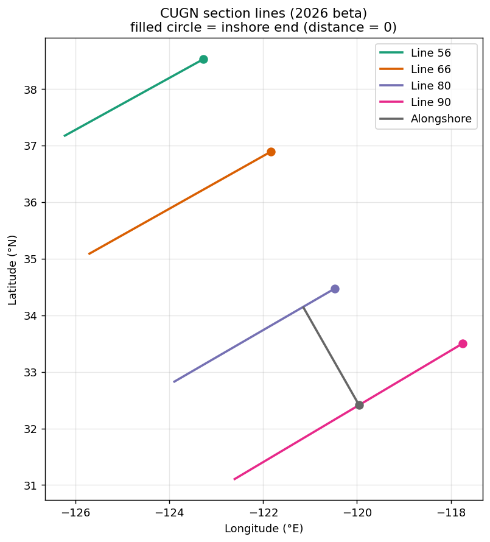

**Short-term mean cross-sections (Line 90, depth).** Warm stratified surface,
fresher surface offshore, a subsurface chlorophyll maximum, and a clear
oxygen-minimum layer at depth inshore (the newly-confirmed `doxy`).

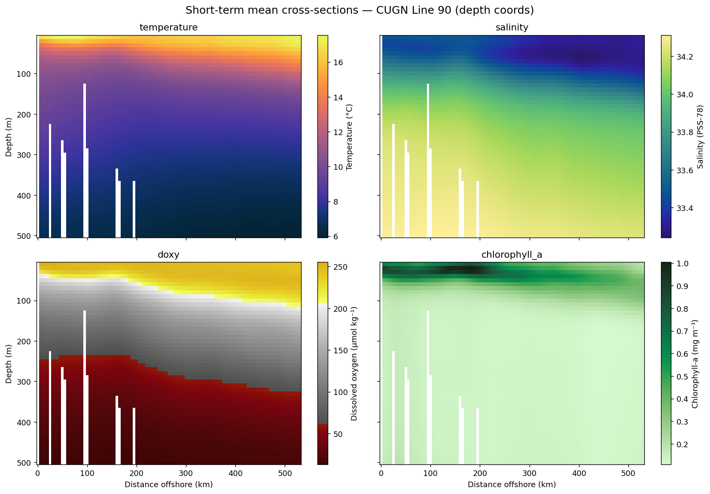

**Mean temperature on potential-density coordinates (Line 90).**

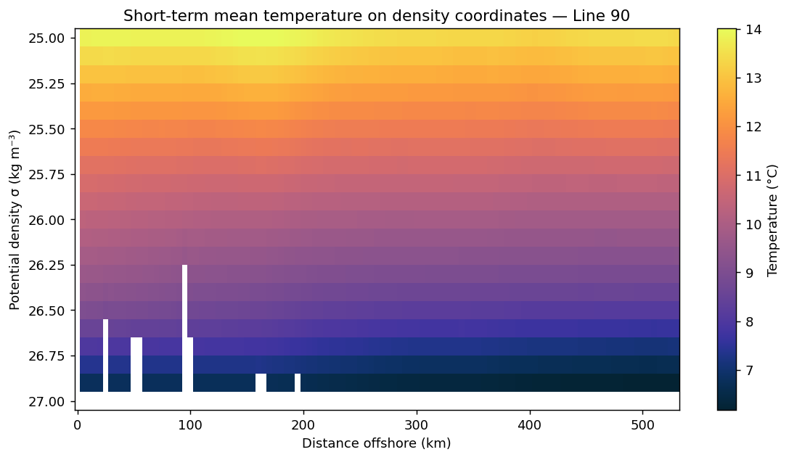

**Seasonal cycle of 10 m temperature vs distance (Line 90).** Warm
late-summer/autumn surface, cool spring.

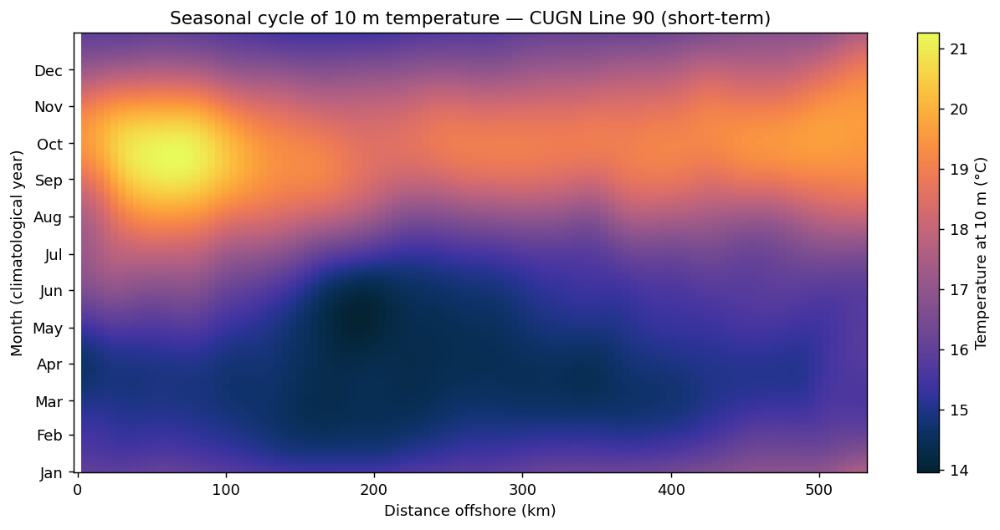

**Interannual 10 m temperature anomaly (time × distance), 2017–mid-2026.**
Coherent warm/cool phases with a strong warm anomaly at the end of the record.

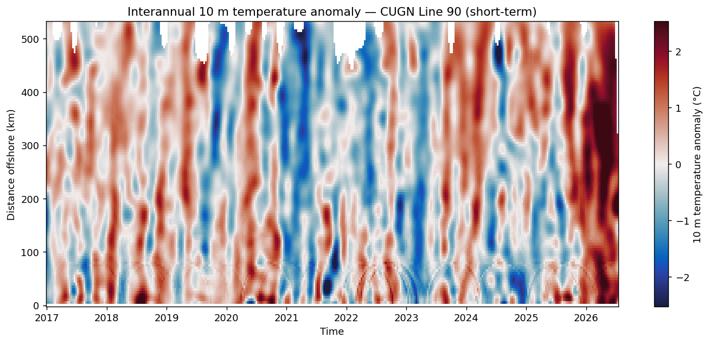

**st − lt mean temperature difference (Line 90).** Coherent surface-intensified
warming (~0.75 °C near-surface, decaying with depth) between the 2007–2014 and
2017–2025 baselines.

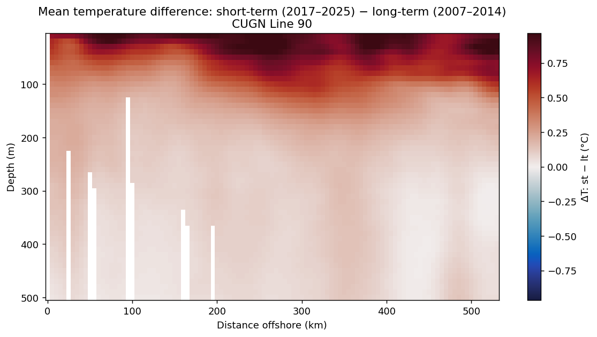

The near-shore white stripes in the depth sections are shallow-bathymetry
stations with no deep bins (expected, not a data error).

## 7. Data coverage / gaps

- NaN fraction in the `mean` fields is ~4–6 % (deep/offshore corners the
  gliders don't reach; Doppler velocities slightly higher at 6.2 %).
- The `total`/`anomaly` time axes are **padded to the end of 2026**: for
  lt_total line 90, data are valid from 2006-10-28 through **2026-07-10**, and
  every 10-day step after that (through 2026-12-27) is entirely NaN. The last
  valid step (2026-07-10) matches today's date — this is a live/rolling product
  with placeholder slots for the rest of the year.

## 8. Deeper exploration (multi-agent, 2026-07-15/16)

Four parallel analyses dug into the data. Their scripts live in
`cugn_climatology/analysis/` (prefixes `wm_`, `seas_`, `iav_`, `bgc_`) and all
figures in `context/figs/` (same prefixes). Highlights:

### 8a. Water masses & stratification (`wm_`)

- Two end-members frame every section: a warm, relatively fresh, **spicy**
  surface layer over cold, salty, weakly stratified thermocline/deep water. All
  lines converge onto a common T–S curve below σθ ≈ 26.5 (shared deep source)
  while their surface signatures fan apart.
- **Clean latitudinal spiciness gradient.** Along-isopycnal spiciness on
  σθ = 25.5 increases monotonically north→south: Line 56 = 0.08 → 66 = 0.27 →
  80 = 0.38 → 90 = 0.45 kg m⁻³ (alongshore 0.43) — subtropical influence grows
  southward; the northern Line 56 even shows a fresh subarctic California
  Current core. The spread collapses with depth as lines share the deep mass.
- Cross-shore: upper-isopycnal spiciness is highest inshore (warmer/saltier
  upwelled water on a density surface), decreasing offshore.
- Stratification (TEOS-10 N²): a pycnocline in the upper ~100 m, shallow
  (~20–40 m) nearshore and deepening offshore (50–90 m); isopycnals shoal toward
  the coast, strongest on Line 90.

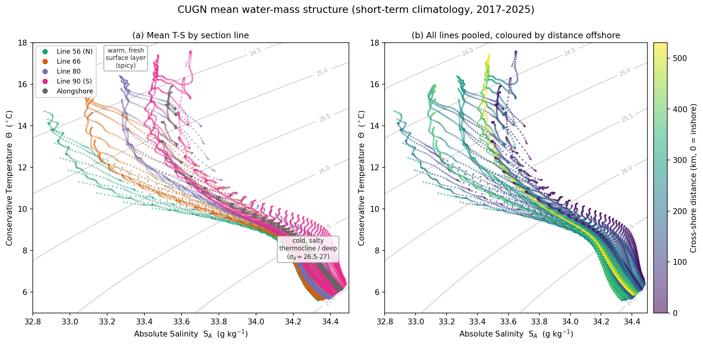

Other figures: `wm_ts_by_line.png`, `wm_spiciness_section.png`,
`wm_isopycnal_spice.png`, `wm_stratification.png`.

### 8b. Seasonal cycle (`seas_`)

- Annual + semiannual harmonics explain **93–95 %** of the daily-climatology
  variance for T and O₂ (~85 % S, ~80 % chl).
- **Temperature:** 10 m amplitude ~2.0–2.3 °C, max in **September**;
  surface-trapped with e-folding depth ≈ 50–70 m. A clean **downward phase
  propagation** — Sep at 10 m → Nov at ~40–60 m → reversing to **Jan–Mar below
  ~70 m** (deep regime governed by isopycnal heave/upwelling, not surface
  heating). Amplitude grows offshore and southward. lt and st give nearly
  identical seasonal amplitude/phase (the baselines differ in the *mean*, §6).
- **Salinity:** subsurface amplitude max at ~50–100 m (halocline migration),
  inshore-intensified. **Chlorophyll:** semiannual ≈ annual (bloom + secondary
  peak), so a single "month of max" is a poor descriptor. **O₂:** 10 m amplitude
  ~9–10 µmol kg⁻¹, max Mar–Apr, amplitude peaking at 50–100 m.

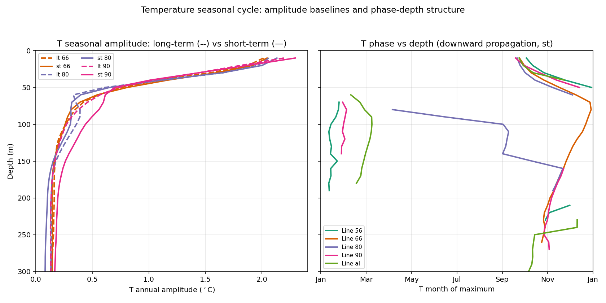

Other figures: `seas_amp_depth_profiles.png`, `seas_amp_sections_st90.png`,
`seas_phase_sections_st90.png`, `seas_surface_crossshore.png`.

### 8c. Interannual variability & marine heatwaves (`iav_`)

- **2014–16 NE Pacific "Blob"** confirmed: dominant sustained MHW, surface
  anomaly above the 90th pct essentially continuously Jul 2014–Nov 2015, peaking
  ~**+3.0 °C** (Line 90), coherent across lines.
- **2025–26 warm event**: an ongoing, even stronger MHW — above threshold from
  Dec 2025 to end-of-record, peaking **+3.3 °C** (Lines 80/90, spring 2026), the
  largest surface anomaly in the record. **Still open at end-of-record — its
  magnitude/duration will grow as data arrive.**
- Cold spells cluster in 2010–2013 (peak −1.85 °C, Sep 2011). Both major warm
  events are **surface-intensified** (0–50 m ~+2.4 °C vs 100–300 m ~+0.3 °C).
- **EOF1** (lt Line 90 T anomaly, 0–300 m) explains **49.9 %** — a
  surface-intensified monopole; PC1 correlates 0.87 with the surface anomaly and
  tracks both the Blob and 2025–26. EOF2 (11.2 %) is a cross-shore dipole.

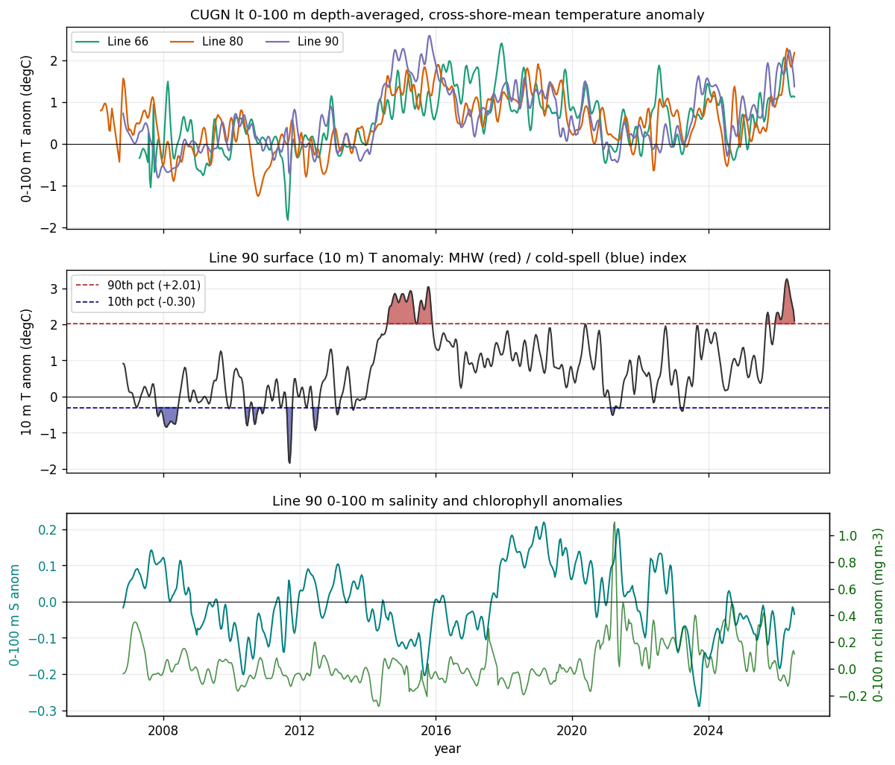

Other figures: `iav_hovmoller_lt.png`, `iav_vertical_crossshore.png`,
`iav_eof.png`, `iav_st_oxygen.png`.

### 8d. Biogeochemistry — oxygen, chlorophyll, backscatter (`bgc_`)

- **OMZ:** oxygen decreases monotonically to the 500 m glider floor, so the
  **true OMZ core lies below the sampled range** — these products resolve its
  upper flank. Hypoxia (<60 µmol kg⁻¹) fills ~37–48 % of the section and
  **shoals southward** (~300 m at Line 56 → ~240 m at Line 90); the near-anoxic
  (<22) fraction rises from 0.4 % (56) to ~14–18 % (90/alongshore).
- **Oxygen is far more organized on isopycnals than on depth surfaces**
  (cross-shore std ~13 vs ~34 µmol kg⁻¹): the hypoxic boundary tracks
  σθ ≈ 26.5, nearly flat cross-shore — apparent depth-space variability is
  mostly isopycnal heave.
- The subsurface chlorophyll max (~30 m inshore, deepening offshore) sits in
  fully oxygenated water, decoupled from the OMZ far below.
- A depth-dependent negative O₂ trend (peak ~−10 µmol kg⁻¹/decade near 140 m)
  exists but is **endpoint-sensitive** — dominated by decay from an
  anomalously oxygenated 2018–19; more likely multi-year variability than a
  robust secular signal over a 9.5-yr record.

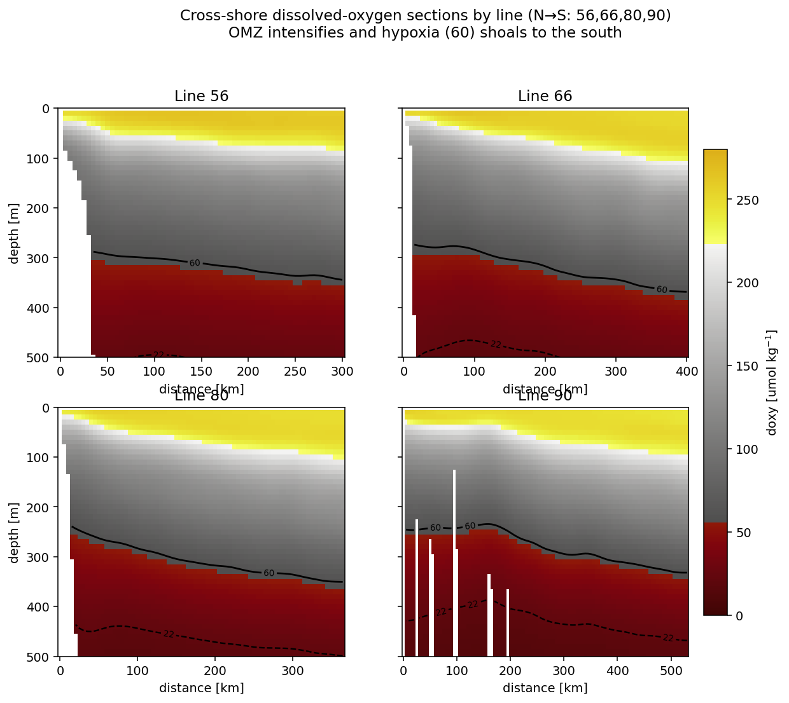

Other figures: `bgc_mean_sections_90.png`, `bgc_oxygen_isopycnals_90.png`,
`bgc_seasonal_90.png`, `bgc_interannual_90.png`, `bgc_backscatter_90.png`.

## 9. Climatology computation code

`cugn_climatology/climatology.py` reproduces the CUGN decomposition
`total = mean + annual_cycle[doy] + anomaly` from any gridded time series:

- `compute_climatology(da, baseline, nharm=3)` → mean (baseline-windowed),
  annual_cycle (multi-harmonic seasonal fit at period 365.25 d, mean-removed),
  and anomaly (residual). Trims trailing all-NaN steps (per Q&A "Trim").
- `validate_against_shipped(...)` compares the recomputed fields to the shipped
  products.

**Validation** (`python -m cugn_climatology.climatology`): our own decomposition
adds back to machine precision (~1e-16); the recomputed **mean matches the
shipped mean to RMS 0.036 °C** (vs 2.5 °C spatial amplitude) and the recomputed
3-harmonic **annual cycle to ~0.08 °C**. The residual reflects that the shipped
products were built from denser Level-3 input, not the 10-day `total` field —
so this is a faithful *methodology* reproduction, validated to be quantitatively
close.

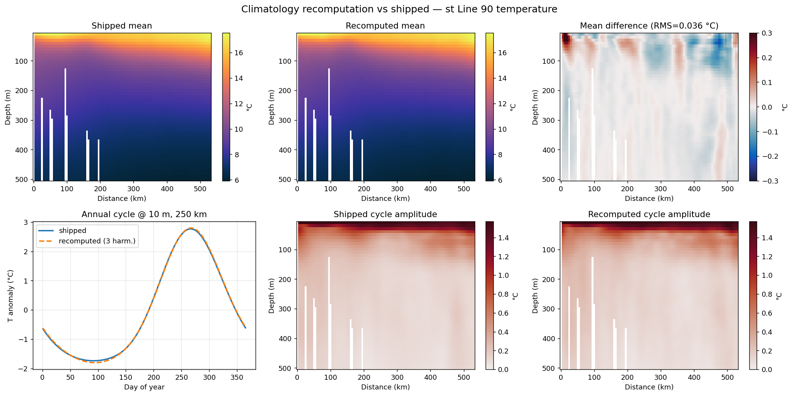

## Resolved (from Q&A, 2026-07-15)

1. **lt vs st intent:** Confirmed — long-term (2007–2014) vs short-term
   (2017–2025) baselines.
2. **Scope:** all lines, both vertical coordinates, all variables.
3. **Oxygen:** you expected DO to be present — and it **is**, in the 50 `st`
   files (see §5). My first-pass "no DO" claim was an artifact of only checking
   `lt` line 90. Corrected.

4. **DO / backscatter only in st:** Confirmed expected — those sensors were not
   available in the long-term baseline.
5. **Chlorophyll-a on density coords:** dropped from `mean_sigma` — you think
   intentional.
6. **End-of-record padding:** **Trim** the trailing all-NaN slots. Applied in
   `climatology.py` and all analysis loaders.

## New open questions (from the deeper exploration, 2026-07-16)

1. **OMZ core below glider range:** oxygen is still decreasing at the 500 m
   floor everywhere, so these products resolve only the upper flank of the OMZ.
   Is 500 m the intended max depth?
2. **`doxy` metadata mismatch:** `long_name` says "Molar Concentration" but the
   values/units are per-mass (µmol kg⁻¹). Worth flagging to the data producer?
3. **Deoxygenation trend framing:** the negative O₂ trend is endpoint-sensitive
   (driven by the high 2018–19 start of a 9.5-yr record). Do you want it
   referenced differently (e.g., excluding MHW years, or vs lt)?
4. **2025–26 marine heatwave is still open** at end-of-record — flag in any
   writeup that its magnitude/duration will grow as data arrive.
5. **MHW index method:** the interannual index used anomaly percentiles (the
   seasonal cycle is already removed), not a formal seasonally-varying Hobday
   climatology on `total`. Redo as Hobday if you prefer.
6. **Diel signals** (e.g., backscatter vertical migration) cannot be assessed —
   these climatological products carry no time-of-day dimension.
